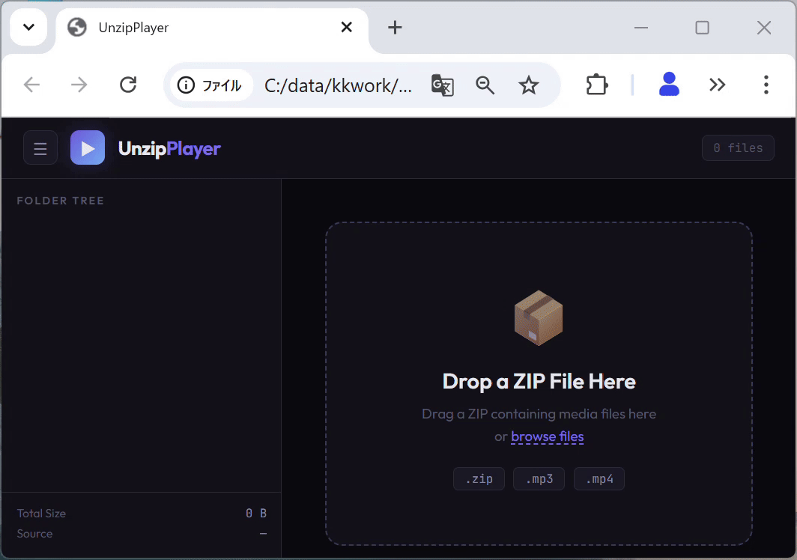

## Overview
UnzipPlayer is a browser-based media player that extracts and plays audio/video files directly from ZIP archives
## Quick Start
[Start UnzipPlayer Demo](https://covao.github.io/UnzipPlayer/unzipplayer.html?zip=https://raw.githubusercontent.com/covao/UnzipPlayer/main/sample_mp3.zip)


## Features
- Single HTML file — no build step, no dependencies to install
- Drag-and-drop ZIP loading with hot-swap replacement
- Encrypted ZIP support (AES-256 / ZipCrypto) with password prompt
- In-memory extraction — files never touch disk
- Built-in ID3 tag parser (v1, v2.2, v2.3, v2.4) with Shift_JIS / UTF-8 / Latin1 auto-detection
- Metadata columns: Title, Artist, Album, Duration
- Folder tree sidebar with recursive playlist view
- Shuffle and repeat playback modes
- Keyboard shortcuts (Space = play/pause, Ctrl+Arrow = prev/next)
- URL parameter loading (`?zip=` or `?file=`)
- Dark theme UI with list and grid views
- Works on `file://` protocol — no local server needed

## Usage

### Basic

Open `media-manager.html` in a browser and drop a ZIP file onto the page. Files are extracted into memory and displayed in a file manager UI. Click any file to play it.

### Encrypted ZIP

If the ZIP is password-protected, a dialog will prompt for the password. Enter it and click **Unlock**. If the password is wrong, you can retry.

### URL Parameters

Load media directly via URL query parameters:

```
media-manager.html?zip=https://example.com/music.zip
media-manager.html?file=https://example.com/song1.mp3&file=https://example.com/song2.mp3
```

> **Note:** The remote server must allow CORS for URL loading to work.

### Keyboard Shortcuts

| Key | Action |
|-----|--------|
| Space | Play / Pause |
| Ctrl + → | Next track |
| Ctrl + ← | Previous track |

### Supported Formats

| Type | Extensions |
|------|-----------|
| Audio | `.mp3` `.wav` `.ogg` `.aac` `.flac` `.m4a` `.wma` |
| Video | `.mp4` `.webm` `.mkv` `.avi` `.mov` `.m4v` `.ogv` |
| Archive | `.zip` (standard and encrypted) |

